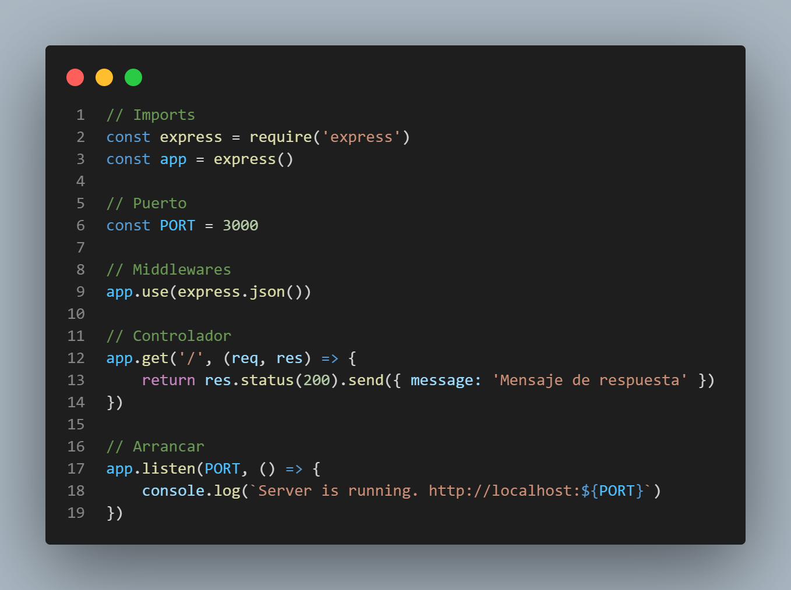

# ¿Cómo crear un servidor web en JavaScript con Express?

Proyecto de ejemplo para el artículo de [¿Cómo crear un servidor web en JavaScript con Express?](https://www.alexcantongarcia.es/blog/javascript-en-el-servidor)

Código de ejemplo de cómo crear un servidor backend con el framework de Express.js

